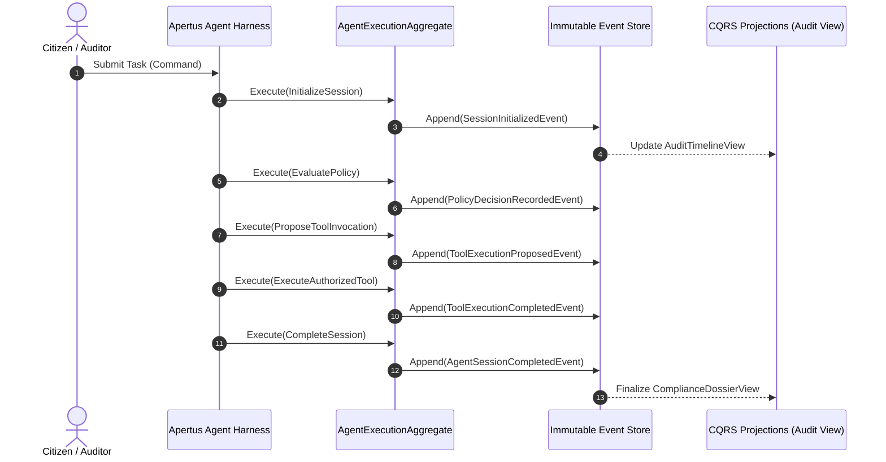

# ADR-003: Event-Sourced Agent Ledger & CQRS Audit Model for Non-Repudiable AI Oversight

**Status:** Accepted  
**Date:** 2026-10-03  
**Deciders:** William Power  
**Project:** Swiss AI Hackathon — Apertus 1.5 (Core for Project 1: Apertus-Auditor)  

---

## Context

When an autonomous agent interacts with regulated data and external systems, traditional logging (e.g. log levels, raw text dumping to Elastic/Datadog) fails regulatory scrutiny under **EU AI Act Article 12 (Record-keeping)** and **FINMA audit requirements**:
1. **Loss of Causal Lineage**: Logs record *that* a tool was called, but cannot prove *why* the model decided to call it, what passport claims were active at that exact millisecond, or whether the output was modified post-generation.
2. **Mutable Storage Risk**: Traditional database rows representing session state can be overwritten, modified, or silently deleted, destroying non-repudiation.
3. **No Time-Travel Debugging**: Regulators and compliance officers cannot step forward and backward through an agent's multi-step reasoning loop to verify decision integrity.

---

## Decision Drivers

- **Deterministic Replayability**: An auditor must be able to load an execution stream and inspect every micro-decision and state change in strict chronological sequence.
- **Cryptographic Tamper-Evidence**: Each state change must be cryptographically chained to its predecessor (hash chaining) so retroactive tampering is mathematically impossible to conceal.
- **Strict CQRS Separation**: High-speed append-only writes to the event store must not be slowed down by complex analytical queries from compliance dashboards.
- **Event Modeling Rigor**: Utilizing the established Event Modeling discipline (`Commands` -> `Events` -> `Read Models`).

---

## Considered Options

| Option | Architecture | Audit Defensibility | Time-Travel Capability |
| :--- | :--- | :--- | :--- |
| **Option A: Distributed Tracing (OpenTelemetry)** | Span-based trace dumps | Moderate: Captures latency & call hierarchy, but payloads are often sampled or truncated. | Poor: No native deterministic state replay. |
| **Option B: Relational CRUD Audit Tables** | SQL tables updated as agent progresses | Low: Prone to race conditions, updates destroy historical state. | None: Only reflects current state, not historical evolution. |
| **Option C: Event-Sourced Immutable Ledger with CQRS (Chosen)** | Append-only event store with SHA-256 hash chaining and async read projections | Maximum: Tamper-evident, non-repudiable proof of causal lineage. | Full: Allows exact step-by-step time-travel replay. |

---

## Decision Outcome

**We choose Option C: Event-Sourced Immutable Ledger with CQRS.**

### The Event Model Contract

#### 1. Commands (Intent to Mutate)
- `InitializeAgentSession(sessionId, userPassport, promptContext)`
- `EvaluatePolicyGate(sessionId, toolName, resourcePayload)`
- `DispatchModelInference(sessionId, modelEndpoint, promptTokens)`
- `ProposeToolInvocation(sessionId, toolName, arguments)`
- `ExecuteAuthorizedTool(sessionId, toolExecutionId, resultPayload)`
- `CompleteAgentSession(sessionId, finalSynthesis)`

#### 2. Domain Events (Immutable Historical Facts)
Every event contains `event_id`, `session_id`, `timestamp`, `event_type`, `payload`, and `previous_event_hash`:
- **`SessionInitializedEvent`**: Captures the validated Agent Passport, user identity, and initial system prompt.
- **`PolicyDecisionRecordedEvent`**: Records Eunomia's `/check` decision (`ALLOW` / `DENY`), active policy version, and evaluated attributes.
- **`ModelInferenceRequestedEvent`**: Records inference metadata, model version (`apertus-1.5-8b` or `apertus-1.5-70b`), and token counts.
- **`ToolExecutionProposedEvent`**: The model's raw unexecuted tool call proposal.
- **`ToolAuthorizationVerifiedEvent`**: Cryptographic confirmation that passport scopes permit execution.
- **`ToolExecutionCompletedEvent`**: Tool output captured with payload hash and execution duration.
- **`AgentSessionCompletedEvent`**: Terminal event containing final synthesis and summary token metrics.

#### 3. Read Projections (CQRS)
- **`AuditTimelineView`**: Tailored for the auditor TUI/CLI. Projects a step-by-step timeline enabling backward/forward scrubbing through the agent's execution history.
- **`ComplianceViolationView`**: Aggregates all denied policy checks, unauthorized tool attempts, and data boundary warnings for executive reporting.
- **`CostAndEnergyLedger`**: Calculates cumulative energy and token expenditure (comparing local edge inference vs. CSCS supercomputer compute).

### Cryptographic Hash Chaining
Every event $E_n$ stores:
$$\text{hash}_n = \text{SHA256}(\text{hash}_{n-1} + E_n.\text{payload} + E_n.\text{timestamp})$$
An auditor verifies the integrity of an entire session by validating the chain from the genesis event to the final completed event. Any tampering in the storage layer immediately breaks the cryptographic chain.

> **Amendment, 2026-10-04 (see [[ADR-005 — Crypto-Shredding for GDPR & FADP Erasure Compatibility]]):** this hash chain is computed over the *stored* payload. For personal-data fields, the stored payload is ciphertext, not plaintext — so a GDPR/FADP erasure request can destroy the decryption key without ever touching a hashed event, leaving this chain's integrity unaffected by erasure.

---

## What Would Change This Decision

If ultra-low latency constraints (< 5ms end-to-end per turn) make synchronous disk writes to SQLite/PostgreSQL impossible. (Even in high-speed local inference, append-only SQLite write latencies are sub-millisecond, thoroughly validating this choice).

---

## Related Documents
- [[ADR-001 — Decoupled Policy Engine over Synchronous Proxy]]
- [[ADR-002 — Agent Passport Schema & Cantonal Jurisdiction Claims]]
- [[ADR-005 — Crypto-Shredding for GDPR & FADP Erasure Compatibility]]
- [[Templates/spec-by-example|Specification by Example Template]]
