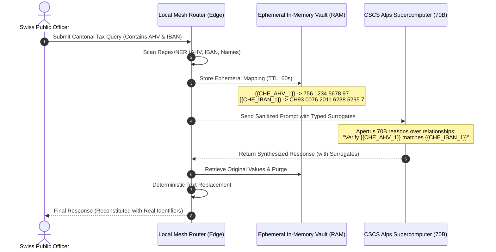

# ADR-004: Deterministic Edge Tokenization with Ephemeral Local Reconstitution

**Status:** Accepted  
**Date:** 2026-10-03  
**Deciders:** William Power  
**Project:** Swiss AI Hackathon — Apertus 1.5 (Core for Project 4: Sovereign-Agent-Mesh)  

---

## Context

In **Project 4 (Sovereign-Agent-Mesh)**, autonomous workloads dynamically split between:
1. **Local Edge Path**: Apertus 1.5 8B GGUF running locally on user hardware for low-latency, strictly confidential operations.
2. **CSCS Cloud Path**: Apertus 1.5 70B running on the CSCS Alps supercomputer for complex multi-step reasoning and massive 262k token document synthesis.

Under the **Swiss Federal Act on Data Protection (FADP)** and banking secrecy rules (FINMA), plain-text Personally Identifiable Information (PII)—including Swiss AHV/AVS national identity numbers, bank IBANs, and cantonal tax records—**must not leave the sovereign local edge perimeter**. 

However, if the local edge simply strips or replaces data with generic `[REDACTED]` markers, the CSCS 70B model's reasoning capabilities degrade significantly, as it loses the relational semantics between entities (e.g., distinguishing whether Entity A or Entity B initiated a financial transaction).

---

## Decision Drivers

- **Zero-Egress Compliance**: No plain-text Swiss PII or confidential cantonal identifiers may touch the external network or CSCS cloud endpoint.
- **Model Reasoning & Attention Fidelity**: The 70B model must retain full relational context, grammatical coherence, and multi-entity tracking across long context windows.
- **Deterministic Reconstitution**: The edge must be able to restore original values into the synthesized response with zero hallucination, zero data corruption, and sub-millisecond overhead.
- **Stateless Cloud Boundary**: The CSCS cloud API must remain completely stateless regarding encryption keys or de-anonymization tables.

---

## Considered Options

| Strategy | Mechanism | Relational Reasoning Quality | Leakage Risk | Local Overhead |
| :--- | :--- | :--- | :--- | :--- |
| **Option A: Hard Masking** | Replace PII with static `[REDACTED]` or `***`. | Extremely Poor: Model cannot distinguish between different redacted entities. | Zero | Minimal |
| **Option B: Local LLM Synthetic Paraphrase** | Local 8B rewrites the prompt into a synthetic fictitious scenario. | Moderate: Preserves narrative flow, but alters technical data structures and adds 1–3s latency. | Low | High (burns local GPU cycles) |
| **Option C: Deterministic Typed Tokenization + Ephemeral Edge Vault (Chosen)** | Regex/NER replaces PII with typed surrogates (`{{CHE_CITIZEN_1}}`); edge reconstitutes via in-memory lookup table. | Excellent: Preserves precise entity relationships, numbers, and cross-references. | Zero | Minimal (< 2ms regex pass) |

---

## Decision Outcome

**We choose Option C: Deterministic Typed Tokenization with an Ephemeral Edge Vault.**



### Protocol Specifications

#### 1. Typed Surrogate Token Standard
Surrogate tokens use unambiguous double-brace markers encoding entity type and index:
* `{{CHE_AHV_n}}`: Swiss Social Security (AHV/AVS) number.
* `{{CHE_IBAN_n}}`: Swiss Bank Account identifier.
* `{{CHE_CANTONAL_ID_n}}`: Enterprise or municipal business UID.
* `{{CHE_PERSON_n}}`: Citizen or counterparty name.
* `{{CHE_AMOUNT_n}}`: Currency quantities requiring masking.

#### 2. Ephemeral In-Memory Vault (RAM-Only)
* Mappings are stored exclusively in non-swappable local RAM (`mlock`).
* Mappings are strictly bound to a single `request_id` and enforced with a 60-second Time-to-Live (TTL).
* Upon response reconstitution or request timeout, the memory block is securely overwritten with zeros (`bzero`).

#### 3. Deterministic Reconstitution Pass
When Apertus 1.5 70B streams its response back, the local edge proxy intercepts the token stream and executes a single-pass string replacement:
```python
def reconstitute_response(cloud_text: str, vault_mapping: dict[str, str]) -> str:
    # Single-pass deterministic token replacement
    import re
    pattern = re.compile("|".join(re.escape(k) for k in vault_mapping.keys()))
    return pattern.sub(lambda m: vault_mapping[m.group(0)], cloud_text)
```

---

## What Would Change This Decision

If CSCS deploys confidential computing nodes (e.g. AMD SEV-SNP or NVIDIA H100 Confidential Computing with remote hardware attestation) where the entire cloud memory perimeter is legally and cryptographically recognized as a sovereign local extension under Swiss FADP.

---

## Related Documents
- [[ADR-001 — Decoupled Policy Engine over Synchronous Proxy]]
- [[ADR-002 — Agent Passport Schema & Cantonal Jurisdiction Claims]]
- [[Swiss AI Hackathon — Apertus]]
